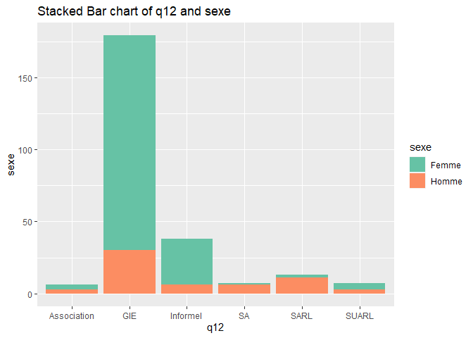
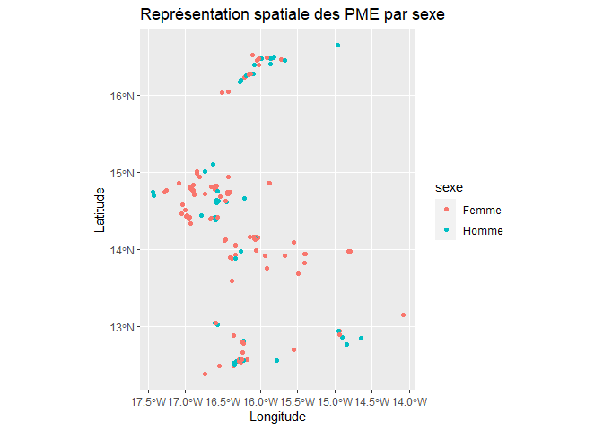
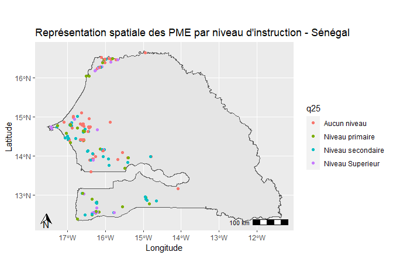

# Résumé
L’objectif de ce projet est d'appliquer les outils que nous avons étudiés pendant le cours du logiciel statistique R, dans le cas d’une étude de cas réelle. Les codes utiliser pour répondre aux questions sont intégrés dans le corps du rapport grâce à R Markdown.

# Objectif de l’étude
Cette enquête vise à identifier et à caractériser des bioénergies durables pour les petites et moyennes entreprises (PME) agroalimentaires d’Afrique de l’Ouest.


# Importation des packages nécessaires et préparation de l'environnement R


```r
library(dplyr)
library(readxl)
library(here)
library(gtsummary)
library(sf)
library(ggplot2)
library(ggspatial)
library(maps)
```


```r
rm(list=ls())
```


```r
setwd(dirname(getwd())) # récupère le dossier dans lequel se trouve le script R, prend le dossier parent et le définit comme working directory
c_dir <- getwd()
```


# Préparation des données

## Description

Le fichier Base_Projet.xlsx contient 250 observations et 33 variables.
La première colonne key correspond à l’identifiant de la PME. Les variables sont les suivantes :
  <ul>
  <li>q1: Région</li>
  <li>q2: Département</li>
  <li>q23: Sexe du dirigeant/responsable de la PME</li>
  <li>q24: Age du dirigeant/responsable de la PME</li>
  <li>q24a_1=1 si le dirigeant/propriétaire de la PME parle le français</li>
  <li>q24a_2=1 si le dirigeant/propriétaire de la PME parle le wolof</li>
  <li>q24a_3=1 si le dirigeant/propriétaire de la PME parle le Diola</li>
  <li>q24a_4=1 si le dirigeant/propriétaire de la PME parle le Serere</li>
  <li>q24a_5=1 si le dirigeant/propriétaire de la PME parle le Peul</li>
  <li>q24a_6=1 si le dirigeant/propriétaire de la PME parle le Mandingue</li>
  <li>q24a_7=1 si le dirigeant/propriétaire de la PME parle le Balante</li>
  <li>q24a_9=1 si le dirigeant/propriétaire de la PME parle le Bambara</li>
  <li>q24a_10=1 si le dirigeant/propriétaire de la PME parle une autre langue</li>
  <li>q25: Niveau d’instruction du dirigeant/responsable de la PME</li>
  <li>q26: Nombre d’années d’expérience professionnelle du dirigeant/responsable de la PME dans l’entreprise</li>
  <li>q12: Statut juridique (SARL, SA, SUARL, GIE, Association, Groupement)</li>
  <li>q14b: Autorisation de fabrication et de mise en vente (FRA)</li>
  <li>q16: L’entreprise est-elle desservie par une route bitumée ?</li>
  <li>q17: Etat de la route bitumée</li>
  <li>q19: l’état de la piste qui mène à l’entreprise</li>
  <li>q20: Avez-vous des associés dans l’entreprise</li>
  <li>filiere_1=1 si la PME est dans la filière arachide</li>
  <li>filiere_2=1 si la PME est dans la filière anacarde</li>
  <li>filiere_3=1 si la PME est dans la filière mangue</li>
  <li>filiere_4=1 si la PME est dans la filière riz</li>
  <li>q8: Activité principale de l’entreprise</li>
  <li>q81: propriétaire ou locataire</li>
  <li>gps_menlatitude: coordonnées géographiques de la PME (latitude)</li>
  <li>gps_menlongitude: coordonnées géographiques de la PME (longitude)</li>
  <li>submissiondate: la date de soumission des informations de la PME</li>
  <li>start: la date de début de l’enregistrement des informations de la PME par l’enquêteur</li>
  <li>today: la date de l’enquête</li>
</ul>


## Importation et mise en forme

<ul>
  <li>Importation de la base de données dans un objet de type data.frame nommé projet</li>
  

```r
projet <- read_excel(paste0(c_dir, "/data/Base_Projet.xlsx"))
```
  
  <li>Nombre de lignes (i.e. le nombre de PME) et de colonnes (i.e. nombre de variables) de la base
projet</li>


```r
n_rows <- nrow(projet)
n_cols <- ncol(projet)
cat("Nombre de PME (lignes): ", n_rows, "\n")
```

```
## Nombre de PME (lignes):  250
```

```r
cat("Nombre de variables (colonnes): ", n_cols, "\n")
```

```
## Nombre de variables (colonnes):  33
```

  <li>Vérification de la présence de valeurs manquantes pour la variable key dans la base projet</li>
  

```r
na_val <- sum(is.na(projet$key))
if (na_val == 0) {
  cat("Il n'y a pas de valeurs manquantes pour la variable 'key'")
} else {
  cat("Il y a", missing_key, "valeurs manquantes pour la variable 'key' dans la base projet.\n")
  cat("Les PMEs concernées sont :\n")
  na_pme <- projet[is.na(projet$key), ]
  print(na_pme)
}
```

```
## Il n'y a pas de valeurs manquantes pour la variable 'key'
```
</ul>

## Création de variables

<ul>
  <li>Rénomination des variables</li>
  

```r
projet <- projet %>%
  rename(region = q1,
         departement = q2,
         sexe = q23)
```

  <li>Création de sexe_2</li>
  

```r
projet$sexe_2 <- ifelse(projet$sexe == "Femme", 1, 0)
```
  
  <li>Création du data.frame langues</li>
  

```r
lang_vars = projet %>%
  dplyr::select(gtsummary::starts_with("q24a_")) %>% names() #variable commençant par q24a_

langues <- select(projet, c("key", lang_vars))
```
  
  <li>Création de la variable 'parle'</li>
  

```r
langues <- langues %>%
  mutate(parle = rowSums(select(., starts_with("q24a_"))))
```
  
  <li>Sélection unique des variables key et parle, l’objet de retour sera langues</li>
  

```r
langues <- langues %>%
  select(key, parle)
```
  
  
  <li>Merger les data.frame langues et projet</li>
  

```r
m_projet <- merge(projet, langues, by="key")
```
  
</ul>

# Analyses descriptives

Fonction univarie():


```r
univarie = function(data, variable, plot = FALSE) {
  tab <- table(data[[variable]])
  print(tab)
  sry <- summary(data[[variable]])
  print(sry)
  is_numeric <- is.numeric(data[[variable]])
  
  if(plot) {
    if (is_numeric) {
      hist(data[[variable]], main = paste("Histogram of", variable), xlab = variable, col = "lightblue")
    } else {
      barplot(tab, main = paste("Barplot of", variable), xlab = variable, col = "lightblue")
    }
  }
}
```


Fonction bivarie():


```r
bivarie <- function(data, x, y, plot = TRUE) {
  tab <- table(data[[x]], data[[y]])
  print(tab)
  
  plots <- list()

  if (plot) {
    # Stacked Bar chart
    plots$stacked <- tryCatch({
      ggplot(data, aes(x = !!rlang::sym(x), fill = !!rlang::sym(y))) + 
        geom_bar(position = "stack") +
        scale_fill_brewer(palette = "Set2") +
        labs(y = y, x = x, title = paste("Stacked Bar chart of", x, "and", y))
    }, error = function(e) NULL)

    # Grouped Bar chart
    plots$grouped <- tryCatch({
      ggplot(data, aes(x = !!rlang::sym(x), fill = !!rlang::sym(y))) + 
        geom_bar(position = "dodge") +
        scale_fill_brewer(palette = "Set2") +
        labs(y = y, x = x, title = paste("Grouped Bar chart of", x, "and", y))
    }, error = function(e) NULL)

    # Scatter plot
    plots$scatter <- tryCatch({
      ggplot(data, aes(x = !!rlang::sym(x), y = !!rlang::sym(y))) +
        geom_point(color = "cornflowerblue", size = 2, alpha = 0.8) + 
        labs(x = x, y = y, title = paste("Scatter plot", x, "vs", y)) +
        geom_smooth(method = "lm", color = "steelblue") +
        geom_smooth(method = "lm", formula = !!rlang::sym(y) ~ poly(!!rlang::sym(x)), color = "indianred3")
    }, error = function(e) NULL)

    # Line plot
    plots$line <- tryCatch({
      ggplot(data, aes(x = !!rlang::sym(x), y = !!rlang::sym(y))) +
        geom_line(size = 1.5, color = "lightgrey") +
        geom_point(size = 3, color = "steelblue") +
        labs(y = y, x = x, title = paste("Line plot", x, "vs", y))
    }, error = function(e) NULL)

    # Bar chart for x
    plots$bar_x <- tryCatch({
      ggplot(data, aes(x = !!rlang::sym(x), y = !!rlang::sym(y))) +
        geom_bar(stat = "identity", fill = "cornflowerblue") +
        labs(title = paste("Bar chart", x, "vs", y), x = x, y = y)
    }, error = function(e) NULL)

    # Bar chart for y
    plots$bar_y <- tryCatch({
      ggplot(data, aes(x = !!rlang::sym(y), y = !!rlang::sym(x))) +
        geom_bar(stat = "identity", fill = "cornflowerblue") +
        labs(title = paste("Bar chart", y, "vs", x), x = y, y = x)
    }, error = function(e) NULL)
  }

  plots
}
```


Répartition des PME suivant:

<ul>
  <li>Le sexe</li>
  

```r
univarie(data = m_projet, "sexe", plot=TRUE)
```

```
## 
## Femme Homme 
##   191    59 
##    Length     Class      Mode 
##       250 character character
```

<!-- -->


<li>Le niveau d'instruction</li>
  

```r
univarie(data = m_projet, "q25", plot=TRUE)
```

```
## 
##      Aucun niveau   Niveau primaire Niveau secondaire  Niveau Superieur 
##                79                56                74                41 
##    Length     Class      Mode 
##       250 character character
```

<!-- -->
  
  
  <li>Le statut juridique</li>
  

```r
univarie(data = m_projet, "q12", plot=TRUE)
```

```
## 
## Association         GIE    Informel          SA        SARL       SUARL 
##           6         179          38           7          13           7 
##    Length     Class      Mode 
##       250 character character
```

<!-- -->
  
  
  <li>Le propriétaire/locataire</li>
  

```r
univarie(data = m_projet, "q24", plot=TRUE)
```

```
## 
##        18        26        27        30        31        32        33        34 
##         1         1         1         3         2         1         5         1 
##        35        36        38        39        40        41        42        43 
##         7         2         5         2        11         4         4         6 
##        44        45        46        47        49        50        51        52 
##         5        15         1         4         5        10         5         9 
##        53        54        55        56        57        58        59        60 
##         3        10        10         7         3        11         6        11 
##        61        62        63        64        65        66        67        68 
##        12         8        10         5        11         3         7         4 
##        69        70        71        73        75        76        78        80 
##         4         6         1         1         1         1         1         1 
##       999      9999 776530031 
##         1         1         1 
##      Min.   1st Qu.    Median      Mean   3rd Qu.      Max. 
##        18        45        55   3106217        62 776530031
```

<!-- -->
  
  
  <li>le statut juridique et le sexe</li>
  

```r
bivarie(m_projet, "q12", "sexe", plot=TRUE)
```

```
##              
##               Femme Homme
##   Association     3     3
##   GIE           149    30
##   Informel       32     6
##   SA              1     6
##   SARL            2    11
##   SUARL           4     3
```

```
## $stacked
```

<!-- -->

```
## 
## $grouped
```

<!-- -->

```
## 
## $scatter
```

<!-- -->

```
## 
## $line
```

<!-- -->

```
## 
## $bar_x
```

<!-- -->

```
## 
## $bar_y
```

<!-- -->
  <li>le niveau d’instruction et le sexe</li>
  

```r
bivarie(m_projet, "q25", "sexe", plot=TRUE)
```

```
##                    
##                     Femme Homme
##   Aucun niveau         70     9
##   Niveau primaire      48     8
##   Niveau secondaire    56    18
##   Niveau Superieur     17    24
```

```
## $stacked
```

<!-- -->

```
## 
## $grouped
```

<!-- -->

```
## 
## $scatter
```

<!-- -->

```
## 
## $line
```

<!-- -->

```
## 
## $bar_x
```

<!-- -->

```
## 
## $bar_y
```

<!-- -->
 
 
  <li>le propriétaire et le sexe</li>
  

```r
bivarie(m_projet, "q24", "sexe", plot=TRUE)
```

```
##            
##             Femme Homme
##   18            1     0
##   26            0     1
##   27            1     0
##   30            1     2
##   31            0     2
##   32            1     0
##   33            2     3
##   34            1     0
##   35            4     3
##   36            2     0
##   38            4     1
##   39            0     2
##   40            6     5
##   41            4     0
##   42            4     0
##   43            5     1
##   44            4     1
##   45           11     4
##   46            1     0
##   47            3     1
##   49            4     1
##   50            6     4
##   51            4     1
##   52            6     3
##   53            3     0
##   54            9     1
##   55            8     2
##   56            5     2
##   57            2     1
##   58            9     2
##   59            3     3
##   60           10     1
##   61            9     3
##   62            6     2
##   63            8     2
##   64            5     0
##   65           11     0
##   66            2     1
##   67            6     1
##   68            3     1
##   69            4     0
##   70            5     1
##   71            1     0
##   73            1     0
##   75            1     0
##   76            1     0
##   78            1     0
##   80            1     0
##   999           0     1
##   9999          1     0
##   776530031     1     0
```

```
## $stacked
```

<!-- -->

```
## 
## $grouped
```

<!-- -->

```
## 
## $scatter
```

<!-- -->

```
## 
## $line
```

<!-- -->

```
## 
## $bar_x
```

<!-- -->

```
## 
## $bar_y
```

<!-- -->
  
</ul>


# Un peu de cartographie

<ul>
  <li>Transformer le data.frame en données géographiques dont l’objet sera nommé projet_map</li>


```r
projet_map <- st_as_sf(m_projet, coords = c("gps_menlongitude", "gps_menlatitude"), crs = 4326)
```

  <li>Code qui permet d'avoir la carte</li>
  

```r
cart = ggplot(projet_map) + 
  geom_sf(data = projet_map, aes(col=sexe), size = 1.5)
cart
```

<!-- -->
  
  <li>Donner des axes, titre, légende, orientation, échelle à la carte ci-dessus</li>
  

```r
cart = ggplot(projet_map) + 
  geom_sf(data = projet_map, aes(col=sexe), size = 1.5) +
  labs(title = "Représentation spatiale des PME par sexe",
       x = "Longitude", y = "Latitude") +
  theme(legend.position = "right")
cart
```

<!-- -->
  
  <li>Importation des shapefiles et affichage</li>
  
  <ul>
    <li>SEN_adm0 répresente le niveau 0 (la carte du Sénegal sans les découpages administratifs)</li>
    <li>SEN_adm1 répresente le niveau 1 (la carte du Sénegal suivant les régions)</li>
    <li>SEN_adm2 répresente le niveau 2 (la carte du Sénegal suivant les départements)</li>
    <li>SEN_adm3 répresente le niveau 3 (la carte du Sénegal suivant les communes)</li>
  </ul>
  

```r
sen_adm0 <- st_read(paste0(c_dir, "/data/gadm41_SEN_shp/gadm41_SEN_0.shp"))
```

```
## Reading layer `gadm41_SEN_0' from data source 
##   `I:\ISEP 3\R\TPD1_SOL\data\gadm41_SEN_shp\gadm41_SEN_0.shp' 
##   using driver `ESRI Shapefile'
## Simple feature collection with 1 feature and 2 fields
## Geometry type: MULTIPOLYGON
## Dimension:     XY
## Bounding box:  xmin: -17.54319 ymin: 12.30786 xmax: -11.34247 ymax: 16.69207
## Geodetic CRS:  WGS 84
```

```r
sen_adm1 <- st_read(paste0(c_dir, "/data/gadm41_SEN_shp/gadm41_SEN_1.shp"))
```

```
## Reading layer `gadm41_SEN_1' from data source 
##   `I:\ISEP 3\R\TPD1_SOL\data\gadm41_SEN_shp\gadm41_SEN_1.shp' 
##   using driver `ESRI Shapefile'
## Simple feature collection with 14 features and 11 fields
## Geometry type: MULTIPOLYGON
## Dimension:     XY
## Bounding box:  xmin: -17.54319 ymin: 12.30786 xmax: -11.34247 ymax: 16.69207
## Geodetic CRS:  WGS 84
```

```r
sen_adm2 <- st_read(paste0(c_dir, "/data/gadm41_SEN_shp/gadm41_SEN_2.shp"))
```

```
## Reading layer `gadm41_SEN_2' from data source 
##   `I:\ISEP 3\R\TPD1_SOL\data\gadm41_SEN_shp\gadm41_SEN_2.shp' 
##   using driver `ESRI Shapefile'
## Simple feature collection with 45 features and 13 fields
## Geometry type: MULTIPOLYGON
## Dimension:     XY
## Bounding box:  xmin: -17.54319 ymin: 12.30786 xmax: -11.34247 ymax: 16.69207
## Geodetic CRS:  WGS 84
```

```r
sen_adm3 <- st_read(paste0(c_dir, "/data/gadm41_SEN_shp/gadm41_SEN_3.shp"))
```

```
## Reading layer `gadm41_SEN_3' from data source 
##   `I:\ISEP 3\R\TPD1_SOL\data\gadm41_SEN_shp\gadm41_SEN_3.shp' 
##   using driver `ESRI Shapefile'
## Simple feature collection with 123 features and 16 fields
## Geometry type: MULTIPOLYGON
## Dimension:     XY
## Bounding box:  xmin: -17.54319 ymin: 12.30786 xmax: -11.34247 ymax: 16.69207
## Geodetic CRS:  WGS 84
```


```r
cart = ggplot(sen_adm0) + 
  geom_sf(data = sen_adm0, aes(), color="black", size = 1.5) +
  ggspatial::annotation_scale(location = "br", line_width = .2) + # Ajout de l'échelle
  ggspatial::annotation_north_arrow(location = "bl",height = grid::unit(0.5, "cm"), width = grid::unit(0.5, "cm"))
cart
```

<!-- -->


```r
cart = ggplot(sen_adm1) + 
  geom_sf(data = sen_adm1, aes(), color="black", size = 1.5) +
  ggspatial::annotation_scale(location = "br", line_width = .2) + # Ajout de l'échelle
  ggspatial::annotation_north_arrow(location = "bl",height = grid::unit(0.5, "cm"), width = grid::unit(0.5, "cm"))
cart
```

<!-- -->


```r
cart = ggplot(sen_adm2) + 
  geom_sf(data = sen_adm2, aes(), color="black", size = 1.5) +
  ggspatial::annotation_scale(location = "br", line_width = .2) + # Ajout de l'échelle
  ggspatial::annotation_north_arrow(location = "bl",height = grid::unit(0.5, "cm"), width = grid::unit(0.5, "cm"))
cart
```

<!-- -->


```r
cart = ggplot(sen_adm3) + 
  geom_sf(data = sen_adm3, aes(), color="black", size = 1.5) +
  ggspatial::annotation_scale(location = "br", line_width = .2) + # Ajout de l'échelle
  ggspatial::annotation_north_arrow(location = "bl",height = grid::unit(0.5, "cm"), width = grid::unit(0.5, "cm"))
cart
```

<!-- -->


  <li>Représentation spatiale des PME suivant le sexe</li>
  

```r
cart = ggplot(sen_adm0) + 
  geom_sf(data = sen_adm0, aes(), size = 1.5) +
  geom_sf(data = projet_map, aes(col=sexe), size = 1.5) +
  labs(title = "Représentation spatiale des PME par sexe - Sénégal(sans découpage)",
       x = "Longitude", y = "Latitude") +
  theme(legend.position = "right") +
  ggspatial::annotation_scale(location = "br", line_width = .2) + # Ajout de l'échelle
  ggspatial::annotation_north_arrow(location = "bl",height = grid::unit(0.5, "cm"), width = grid::unit(0.5, "cm"))
cart
```

<!-- -->


```r
cart = ggplot(sen_adm1) + 
  geom_sf(data = sen_adm1, aes(), size = 1.5) +
  geom_sf(data = projet_map, aes(col=sexe), size = 1.5) +
  labs(title = "Représentation spatiale des PME par sexe - Régions Sénégal",
       x = "Longitude", y = "Latitude") +
  theme(legend.position = "right") +
  ggspatial::annotation_scale(location = "br", line_width = .2) + # Ajout de l'échelle
  ggspatial::annotation_north_arrow(location = "bl",height = grid::unit(0.5, "cm"), width = grid::unit(0.5, "cm"))
cart
```

<!-- -->


```r
cart = ggplot(sen_adm2) + 
  geom_sf(data = sen_adm2, aes(), size = 1.5) +
  geom_sf(data = projet_map, aes(col=sexe), size = 1.5) +
  labs(title = "Représentation spatiale des PME par sexe - Départements Sénégal",
       x = "Longitude", y = "Latitude") +
  theme(legend.position = "right") +
  ggspatial::annotation_scale(location = "br", line_width = .2) + # Ajout de l'échelle
  ggspatial::annotation_north_arrow(location = "bl",height = grid::unit(0.5, "cm"), width = grid::unit(0.5, "cm"))
cart
```

<!-- -->


```r
cart = ggplot(sen_adm3) + 
  geom_sf(data = sen_adm3, aes(), size = 1.5) +
  geom_sf(data = projet_map, aes(col=sexe), size = 1.5) +
  labs(title = "Représentation spatiale des PME par sexe - Communes Sénégal",
       x = "Longitude", y = "Latitude") +
  theme(legend.position = "right") +
  ggspatial::annotation_scale(location = "br", line_width = .2) + # Ajout de l'échelle
  ggspatial::annotation_north_arrow(location = "bl",height = grid::unit(0.5, "cm"), width = grid::unit(0.5, "cm"))
cart
```

<!-- -->


  <li>Représentation spatiale des PME suivant le niveau d’instruction</li>
  

```r
cart = ggplot(sen_adm0) + 
  geom_sf(data = sen_adm0, aes(), size = 1.5) +
  geom_sf(data = projet_map, aes(col=q25), size = 1.5) +
  labs(title = "Représentation spatiale des PME par niveau d'instruction - Sénégal",
       x = "Longitude", y = "Latitude") +
  theme(legend.position = "right") +
  ggspatial::annotation_scale(location = "br", line_width = .2) + # Ajout de l'échelle
  ggspatial::annotation_north_arrow(location = "bl",height = grid::unit(0.5, "cm"), width = grid::unit(0.5, "cm"))
cart
```

<!-- -->
  
  

```r
cart = ggplot(sen_adm1) + 
  geom_sf(data = sen_adm1, aes(), size = 1.5) +
  geom_sf(data = projet_map, aes(col=q25), size = 1.5) +
  labs(title = "Représentation spatiale des PME par niveau d'instruction - Régions Sénégal",
       x = "Longitude", y = "Latitude") +
  theme(legend.position = "right") +
  ggspatial::annotation_scale(location = "br", line_width = .2) + # Ajout de l'échelle
  ggspatial::annotation_north_arrow(location = "bl",height = grid::unit(0.5, "cm"), width = grid::unit(0.5, "cm"))
cart
```

<!-- -->


```r
cart = ggplot(sen_adm2) + 
  geom_sf(data = sen_adm2, aes(), size = 1.5) +
  geom_sf(data = projet_map, aes(col=q25), size = 1.5) +
  labs(title = "Représentation spatiale des PME par niveau d'instruction - Départements Sénégal",
       x = "Longitude", y = "Latitude") +
  theme(legend.position = "right") +
  ggspatial::annotation_scale(location = "br", line_width = .2) + # Ajout de l'échelle
  ggspatial::annotation_north_arrow(location = "bl",height = grid::unit(0.5, "cm"), width = grid::unit(0.5, "cm"))
cart
```

<!-- -->


```r
cart = ggplot(sen_adm3) + 
  geom_sf(data = sen_adm3, aes(), size = 1.5) +
  geom_sf(data = projet_map, aes(col=q25), size = 1.5) +
  labs(title = "Représentation spatiale des PME par niveau d'instruction - Communes Sénégal",
       x = "Longitude", y = "Latitude") +
  theme(legend.position = "right") +
  ggspatial::annotation_scale(location = "br", line_width = .2) + # Ajout de l'échelle
  ggspatial::annotation_north_arrow(location = "bl",height = grid::unit(0.5, "cm"), width = grid::unit(0.5, "cm"))
cart
```

<!-- -->


</ul>


